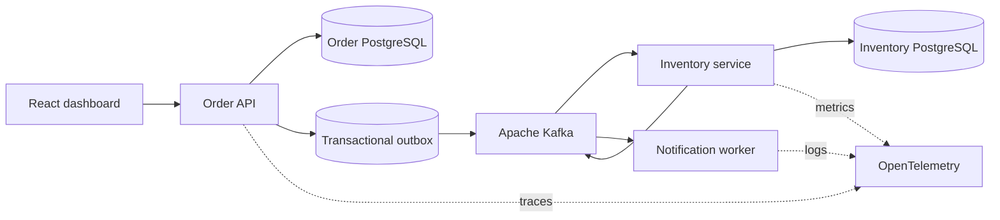

# OrderFlow Platform

Plataforma de pedidos e reserva de estoque para pequenos varejistas que vendem em mais de um canal e precisam evitar venda sem estoque, reservas duplicadas e pedidos presos após falhas de integração.

> **Estado:** planejamento concluído; implementação ainda não iniciada. O roadmap e as decisões arquiteturais serão atualizados à medida que o código for entregue.

## Problema

Uma loja que recebe pedidos pelo site e por canais externos pode vender a última unidade duas vezes quando a atualização de estoque atrasa. A confirmação também pode falhar no meio do processo, deixando o cliente sem resposta e o estoque reservado indevidamente.

O projeto implementará esse fluxo com processamento assíncrono, idempotência, rastreabilidade e recuperação de falhas. O painel React permitirá que a operação encontre pedidos presos e acompanhe retentativas sem consultar diretamente o banco. Cada tecnologia deverá resolver um problema documentado; o repositório não será uma coleção de ferramentas sem função no domínio.

## Usuários e resultado esperado

- **Operação da loja:** visualiza o estado de cada pedido e recupera exceções com segurança.
- **Atendimento:** explica ao cliente se o pedido está confirmado, aguardando estoque ou cancelado.
- **Equipe técnica:** identifica falhas por logs, métricas e traces correlacionados.
- **Negócio:** reduz vendas sem estoque e mantém evidência de cada mudança de estado.

## Escopo funcional

- criar e consultar pedidos;
- reservar e liberar estoque;
- acompanhar a evolução do pedido;
- publicar e consumir eventos de domínio;
- impedir processamento duplicado;
- encaminhar mensagens irrecuperáveis para uma dead-letter queue;
- consultar o histórico de eventos e tentativas;
- exibir o estado operacional em um painel React enxuto.

## Arquitetura planejada

Consulte [a arquitetura](docs/architecture.md) e [o roadmap](docs/roadmap.md) antes da implementação.

## Stack planejada

- Java 21 e Spring Boot 3;
- Spring Web, Spring Data JPA, Spring Security e Bean Validation;
- PostgreSQL e Flyway;
- Apache Kafka;
- JUnit 5, Mockito, Testcontainers e WireMock;
- Docker Compose para o ambiente local;
- Kubernetes e Helm para orquestração;
- Terraform para infraestrutura reproduzível na AWS;
- Amazon EKS, ECR, RDS e CloudWatch;
- OpenTelemetry, Prometheus e Grafana;
- React e TypeScript no painel operacional;
- GitHub Actions para integração contínua.

## Critérios de qualidade

- nenhuma credencial no repositório;
- migrações versionadas;
- contratos HTTP documentados com OpenAPI e Swagger UI;
- testes unitários, de integração e de arquitetura;
- cobertura das regras críticas, sem meta usada como substituto de qualidade;
- imagens de container sem execução como `root`;
- análise estática e verificação de dependências no CI;
- health checks, métricas, logs estruturados e rastreamento distribuído;
- decisões relevantes registradas como ADRs;
- evidência de falhas testadas, inclusive duplicidade, indisponibilidade e repetição de mensagens.

## Execução local

Os comandos serão publicados junto da primeira entrega executável. Até lá, não há artefato funcional para executar.

## Roadmap

O desenvolvimento será incremental. Cada fase deverá terminar com código executável, testes e documentação atualizada:

1. domínio de pedidos e estoque em um monólito modular;
2. persistência PostgreSQL, migrações e API REST;
3. autenticação, autorização e auditoria;
4. extração do processamento assíncrono com Kafka e outbox;
5. idempotência, retry, DLQ e testes de falha;
6. observabilidade;
7. containers e Kubernetes local;
8. infraestrutura AWS com Terraform;
9. painel React e demonstração publicada.

O painel React será a demonstração principal do fluxo de negócio. Swagger UI continuará disponível para que recrutadores e avaliadores possam inspecionar e experimentar os contratos do backend sem depender da interface web.

## Documentação

- [Arquitetura](docs/architecture.md)
- [Roadmap](docs/roadmap.md)
- [ADR 0001 — evolução incremental da arquitetura](docs/adr/0001-evolucao-incremental.md)
- [Como contribuir](CONTRIBUTING.md)
- [Política de segurança](SECURITY.md)

## Licença

Distribuído sob a licença MIT. Consulte [LICENSE](LICENSE).
